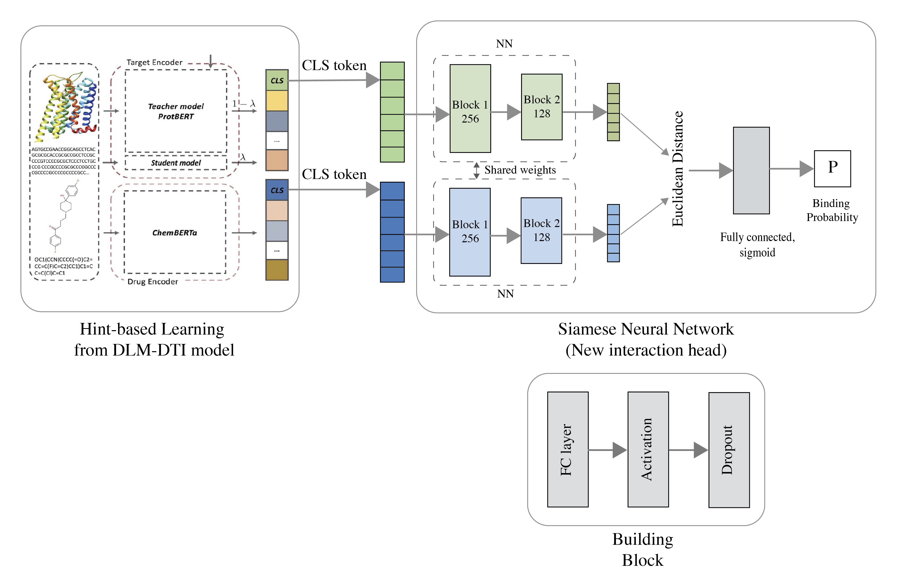

# HintS-DTI
#### Drug-target interaction prediction using large language model with hint-based learning and siamese network.

This project is a modified version of DLM-DTI_hint-based-learning (https://github.com/jonghyunlee1993/DLM-DTI_hint-based-learning) by Jonghyun Lee et al. (https://jcheminf.biomedcentral.com/articles/10.1186/s13321-024-00808-1). The original project focuses on leveraging pretrained language models on molecular (drug) and protein structures to improve the prediction performance of drug-target interactions.

Under the conclusion section, Jonghyun Lee et al. mentioned the need for enhancement in the design of the interaction head. Thus, I utilized a Siamese Neural Network to implement the interaction head. The proposed model is outlined below.

## Datasets

Same datasets used in DLM-DTI_hint-based-learning. 
- DAVIS, Binding DB, and BIOSNAP
- Data downloaded from [MolTrans](https://github.com/kexinhuang12345/MolTrans/tree/master/dataset)

## Installation and Execution

Same as the original DLM-DTI_hint-based-learning model.

## Acknowledgements

I would like to express my gratitude to Jonghyun Lee et al. for creating the original project and for their valuable contributions to the field. Without their work, this modified version would not have been possible.

## References
Lee, J., Jun, D.W., Song, I. et al. DLM-DTI: a dual language model for the prediction of drug-target interaction with hint-based learning. J Cheminform 16, 14 (2024). https://doi.org/10.1186/s13321-024-00808-1
